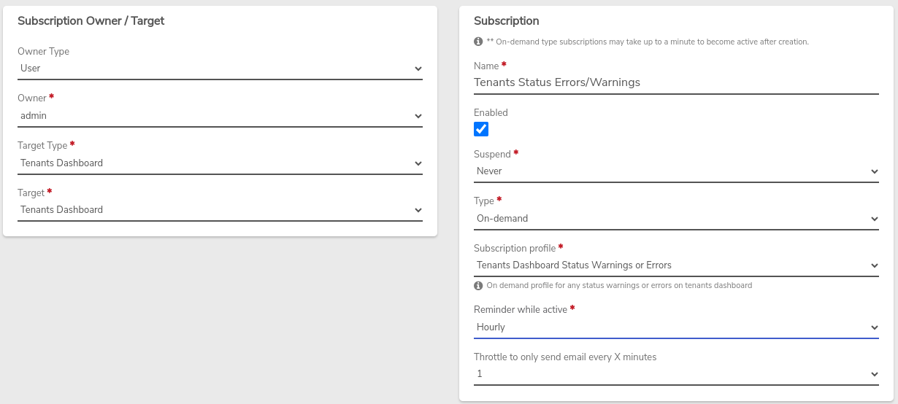

# Monitoring Tenants

This page discusses the use of Dashboards and Subscriptions to oversee Tenants.  Dashboards will provide a lot of helpful information about Tenants. Subscriptions allow for sending reports and on-demand alerts based upon various events.

## The All-Tenants Dashboard (summary info)
The All-Tenants Dashboard provides an overview of Tenants and links to drill down to more detailed information.

**To access the All-Tenants Dashboard:**
Click on **Tenants** from the Main Dashboard (**Quick-link or left menu**).

**Counts/Status Indicators**
In the top left of the Tenants Dashboard, the Counts and status indicators will show the number of Tenants powered on/total number of Tenants; and the number of Tenant Nodes powered on/total number of Tenant Nodes. These count boxes are click-able to access the list of Tenants or list of Tenant Nodes, respectively.

**Tenants Usage**
This view provides a **quick view** of the top usage among your Tenants, across **CPU, RAM, Storage, and Network**. Each list entry in these sections is also a **link** to that Tenant’s Dashboard to quickly access more detailed information about the particular Tenant.   

 
 
## Individual Tenant Dashboards
Each Tenant has its own Dashboard to show configuration and summary information for the individual Tenant, with each card on the dashboard providing a link to increased detail.

**To access a particular Tenant’s Dashboard:**
1. From the (All) Tenants Dashboard, click **Tenants**.
1. A list of all Tenants appears.
1. **Double-click** on the **desired Tenant**. 

### Understanding Storage Used/Provisioned/Allocated

* **Provisioned** - the amount of (post-deduplication **\***) storage that has been specified as available to the tenant.  
A Tenant's provisioned storage is not a hard limit.  However, alerts are triggered based on this threshold; monitor the All-Tenants Dashboard and Logs for warnings and alerts.  Subscriptions (covered below) provide an easy way to track tenant dashboards, alerts and errors." <!-- check on this - what alerts/errors/warnings trigger for this exactly?  automatic at a certain percentage? -->

* **Used** - reflects the tenant's actual consumed storage, after deduplication **\***. 

* **Allocated** - identifies the top amount of storage that would be utilized should all the Tenant's disk devices be filled to capacity. The amount of allocated storage can often show a much larger number than used or provisioned because device files are thin provisioned; the amount of storage allocated to a VM drive/NAS volume is not actually consumed by the vSAN until actually used, e.g. a 4TB VM drive that only contains 200GB of data has 4TB allocated, but only consumes 200GB of vSAN space(minus any deduplication)

    **\*** Tenant storage numbers only consider deduplication within the tenant's own stored data. Cross-tenant deduplication is not factored in.

**Usage Statistics**
CPU, RAM, and Storage usage for the Tenant is provided in graph form (**5-minute intervals**) as well as statistic listings for the current **5-second “heartbeat”**, with statistics information saved at **5-minute** intervals (**corresponding to standard 95th percentile standards for billing**). History links allow you to gather usage information for specific periods. 

**To see more granular detail on graphs:** Click and drag a subset of the graph to see more detail for that selected timeframe.
Double-click to back out to the original detail level.

**Logs**  
The most recent log entries will show on the Dashboard screen. Errors are highlighted in red for easy recognition. Click the **--View More--** link at the bottom to view further back in the logs. 

 

## Subscriptions
Subscriptions can provide both scheduled reports and on-demand alerts when errors, warnings, or specified changes occur, or if configured thresholds are reached.    
Subscription alerts are sent to the defined email address(es) of the recipient(s).

The Subscription engine allows you to customize how and when you receive reports and notifications.  The Following examples demonstrate Tenant-related Subscriptions that can help in ongoing monitoring of the health and usage of Tenants.  

**I. Example configuration - receive alerts for any status errors or warnings related to Tenants:**

**II. Example configuration - 7:15 am daily report of the All-Tenants Dashboard (overview information):**

**III. Example configuration - weekly report (to the Administrators Group) showing summary information for a specific Tenant:**

  

There are many options available when creating Subscriptions.  For more information see: [**Subscriptions-Overview**](/product-guide/subscriptions-overview)